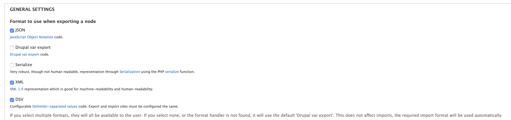

# InOut_OutIn
* *Environment : #/bin/bash!*
* *Requirement : gdal imagemagick geomet gpsbabel bc inotify-tools*

Output settings:



Then

```
sudo ./drush.phar ne-export --format=JSON --file=AllNodes.txt
```

Or, with spécific content type. Here image

```
sudo ./drush.phar ne-export --type=image --format=JSON --file=AllImages.txt
```
Import Images

```
sudo ./drush.phar node-export-import --file=AllImages.tx
```
Export NodeID

```
sudo ./drush.phar node-export-export 45 46 47 --file=filename
```

https://www.drupal.org/project/project_module

Export All Taxonomies TID & Names pipe separated

```
sudo ./drush.phar taxocsv-export all --delimiter="|" tid
```

Exported :
```
taxocsv.csv
```

Backtrace

```
./drush.phar watchdog-show --extended --tail
```

From PHP :

```
shell_exec("./drush.phar node-export-export '{$node->nid}' --format=JSON --file=echo.txt");
```

Distance parcourue ellipsoid (mètres) depuis EPSG:27561 vers EPSG:4326 : 

```
from osgeo import ogr
wkt = "LINESTRING (599014.56614022 122720.336597501 0, 599006.884341363 122730.553142569 0, 599043.436147199 122757.459124949 0)"
geom = ogr.CreateGeometryFromWkt(wkt)
print "Length = %2f" % geom.Length()
```
Distance parcourue en pied de roi (Charlemagne) utilisé entre 1668 et 1799 d'une longueur de 324,839 mm Toises / Pieds-de-roi / Pouces - conversion :

```
3810 métres -> 1954 Toises 5 Pieds du roi 10 Pouce(s)
```

Distance parcourue en pied de roi ancien ou carolingien utilisé avant 1668 d'une longueur de 326,596 mm Toises / Pieds-de-roi / Pouces - conversion :

Caractères INTERDITS dans le nom  .kml :
```
" | & < > <- -> /\ \/ 
```
Caractères OK
```
★ • ↓ ↑ ← → 
```
Awk tid type_de_consolidation
```
cat NodePoi.csv | awk -F'field_type_de_consolidation' '{print $2}' |  awk -F'tid'\'' => '\'''  '{print $2}' | awk -F''\'',' '{print $1}'|awk '!/./ || !seen[$0]++'|awk 'NF'
```

print a map in a template :
```
<?php $map = openlayers_map_load('igc_hd');
$output = openlayers_render_map($map->data,$map->name);
print $output; ?>
```

```
$map = openlayers_map_load('your_map');
$map->data['layer_activated']['your_layer'] = 'your_layer';
$map->data['layers']['your_layer'] = 'your_layer';
$map->data['behaviors']['openlayers_behavior_zoomtolayer']['zoomtolayer']['your_layer'] = 'your_layer';    
$output = openlayers_render_map($map->data,$map->name);
```


Movie to gif :
```
ffmpeg -i mymovie.mp4 -vf "fps=10,scale=1080:-1:flags=lanczos" -c:v pam -f image2pipe - | convert -delay 10 - -loop 0 -layers optimize MyOutput.gif
```

Cut image in 4 equale quadrant :

```
convert image.tif -resize 50% -crop 2x2@ out_%02d.tif
```


Import csv for POIs Images and Access type

```
./drush feeds-import -y point_dinteret_automatic_update --file=a.csv
```

export Geotiff with alpha from no data 0

```
gdalwarp -dstalpha -srcnodata 0 -co "ALPHA=YES" source.tif dest_RGBA.tif
```

Crontab generator : https://crontab.guru

Eexport video timestamp : 

psql -d ladb

```
COPY movie_timestamps TO '/var/lib/postgresql/Timestamp_export.csv' DELIMITER '|' CSV HEADER;
```


## Procedure to import Nodes with geotags
1 import taxonomies wia feeds
Remove duplicate rows befor importing Taxonnomy

```
cat ___TEST.txt | awk '!seen[$0]++' > ___TEST_NO_DUPES.txt
```

2 import nodes via feeds

awk print only rows if $2 is empty :

```
awk -F'|' '$2==""'
```

awk remove rows if $2 is empty :

```
awk -F'|' '$2!=""'
```


geomet WKT export 

```
geomet --wkt 
```
